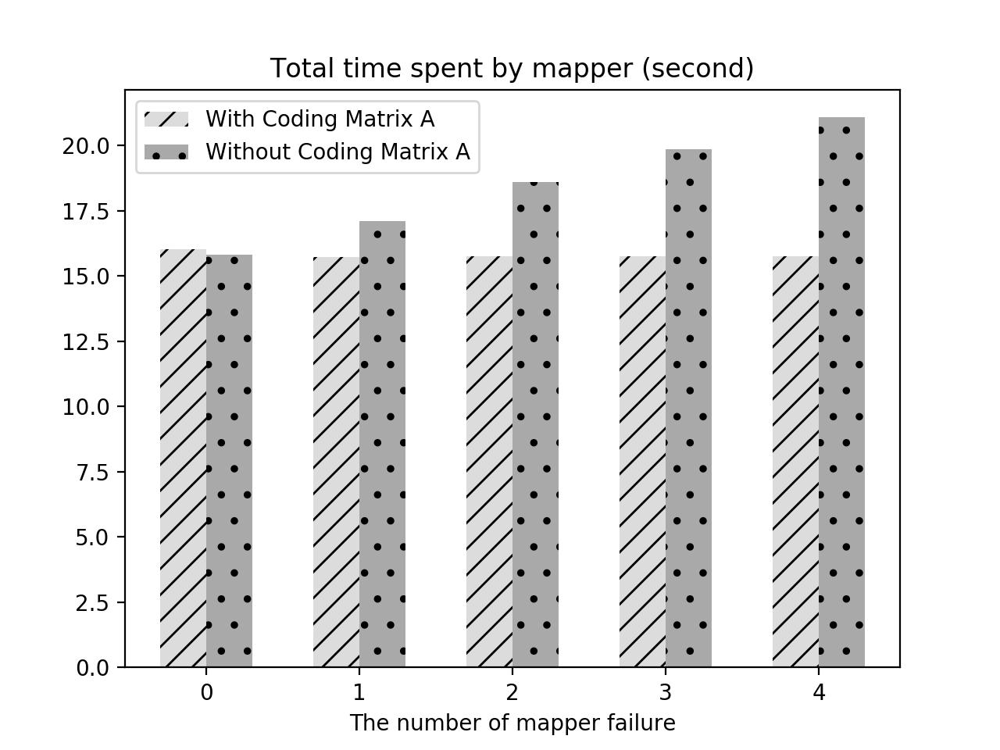
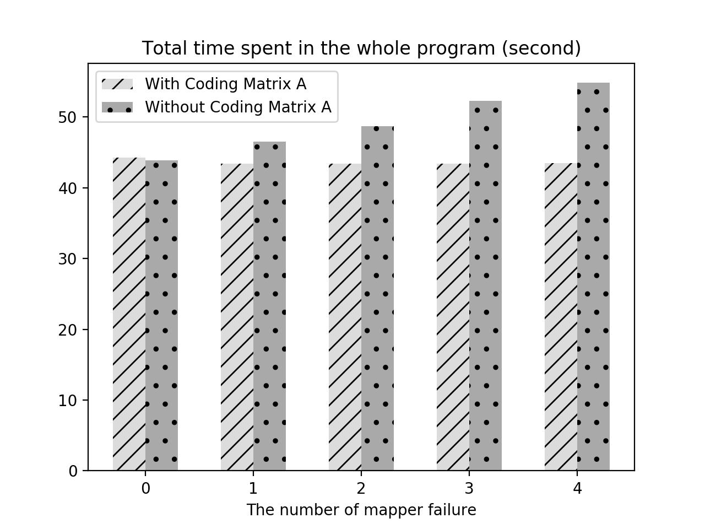

# Overview

The code is for implementation of the research paper:

When Exascale Computing Meets Network Coding: Scalable and Fault-Tolerant Computation for Arbitrary-precision Arithmetic

# Dependencies

[Hadoop 2.9.1](http://hadoop.apache.org/docs/r2.9.1/index.html)

# Usage

Prime number setting is in `CRT.java` file and does not recommend to change.

Code model and fail map number setting is in `config.properties`, specific details can refer to `run.bash`.

`Run.bash` is a script program for testing the code.

### Step 0

Install hadoop 2.9.1 and make sure [this](https://hadoop.apache.org/docs/stable/hadoop-project-dist/hadoop-common/SingleCluster.html) can work correctly.

### Step 1

Create a file `config.properties` and write as:

    OPTION=false
    FAILED_NUMBER=0
    
You can also change the settings later.

### Step 2

Compile and run the entire program:

    hadoop com.sun.tools.javac.Main CRTMatrixD.java CRTMapper.java CRTReducer.java CRT.java
    jar cf CRT.jar CRT*.class
    hadoop jar CRT.jar CRT /user/[username]/crt/input /user/[username]/crt/output

### Step 3

The output file can be seen by:

    hadoop fs -cat /user/[username]/crt/output/part-r-00000

Other information can be seen in logs.

### AWS settings

Our project can be easily put on AWS or other cloud services. There are two ways to create MapReduce project on AWS. We use the EC2 to create every node, which is flexible but a little complex. The launched instances should equal the sum of the Namenode and Datanode. A detailed introduction can be seen at [2].

You can also choose Amazon EMR[1] to create the project directly.

# Result

The average time for each mapper and the entire running time of the simulations for different number of failed mappers are compared below.

### Average computation time for mappers.

### Entire time of the simulations.

------
[1] https://aws.amazon.com/emr/

[2] https://medium.com/@jeevananandanne/setup-4-node-hadoop-cluster-on-aws-ec2-instances-1c1eeb4453bd
